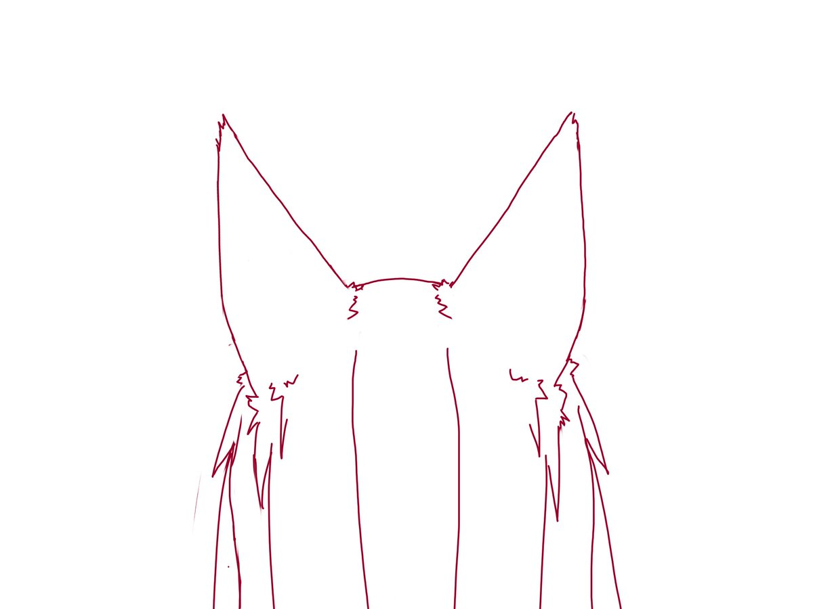

## サークル管理アプリ作成プロジェクトUnisle
*はこだて未来大学　なんでも探求クラブの初年度プロジェクト

* 内容：当サークル用便利アプリの開発
* メンバー募集：常時募集、開発を楽しめる人（重要！）
* 期間：今年度内に完成を目指す
* 活動密度：週一回程度 + 自由作業
* フィードバック：二週間に一回

計画ドキュメント:
- https://docs.google.com/document/d/1sod-fd5aCdDr7TDYVjpg3wTdEKoDcug_aexigC7wmP0/edit?usp=sharing

サークルメール：tankyuclub@gmail.com

# 製品：Unisle

## 製品概要
### コンセプト
個々の個性を引き出す
お互いについての情報を増やすことでよりコラボレーションを促進する

### 背景（製品開発のきっかけ、課題等）
サークル内での講義やプロジェクトの立ち上げ、コラボなどを気軽にできるような仕組みを作りたい。
サークルの活動についての情報を適切な形で管理したい。
などの想いから本アプリを開発することに決定。

### 製品説明（具体的な製品の説明）

### 特長

#### 1つ目 
ほげほげ

#### 2つ目
ほげほげ

#### Nつ目  
ほげほげ

### 解決出来ること
* サークルでのコミュニケーションが不足している状況
* 同じサークルに入っているけどなかなか同士が見つからない状況
* チームで活動したいけどチームが作れていない状況
* お互いの予定を知らないから気軽なお誘いもしにくい状況
* 仲間が興味を持っていることを知りたい状況
* 仲間がどんな風に活動、努力しているのか知りたい状況

### 今後の展望
- ほげほげ
- ほげほげ

## 開発内容・開発技術
### 活用した技術
#### 言語
- HTML & CSS
- JavaScript

#### フレームワーク・ライブラリ・モジュール
- Firebase/Hosting,RealTimeDatabase,CloudFunction,Authentication
- BootStrap

## メンバーの役割
- 伊藤　壱：サーバーサイド全般、データ構造の設計、デプロイ、アプリ機能の考案、アプリ全体の思想設計
- 未来 二郎：バックエンドとかArduinoとか、わかりやすく
- 未来 花子：デザイン（アプリロゴ）とか、とにかくやったことを書いてください
